# 🎉 Configuration GitHub Actions pour Glou Android - TERMINÉ

## ✅ Statut : Configuration complète

L'application **Glou Android** est maintenant entièrement configurée pour des builds automatiques via **GitHub Actions**.

---

## 📦 Fichiers créés/modifiés

### 🔧 Workflow CI/CD
| Fichier | Description |
|---------|-------------|
| `.github/workflows/build_apk.yml` | ⭐ Workflow principal (tests + builds APK/AAB signés) |
| ~~`.github/workflows/flutter-ci.yml`~~ | ❌ Supprimé (remplacé par build_apk.yml) |

### 🔨 Configuration Android
| Fichier | Description |
|---------|-------------|
| `android/app/build.gradle` | ✏️ Modifié - Configuration de signature des releases |
| `android/app/proguard-rules.pro` | ✨ Nouveau - Règles d'obfuscation ProGuard |
| `android/key.properties.example` | ✨ Nouveau - Template pour configuration locale |

### 📚 Documentation (Français)
| Fichier | Description |
|---------|-------------|
| `docs/FR/GITHUB_ACTIONS.md` | Guide complet de configuration |
| `docs/FR/BUILD_CHEATSHEET.md` | Commandes rapides et aide-mémoire |
| `docs/FR/SETUP_CHECKLIST.md` | Checklist de configuration pas à pas |
| `docs/FR/CONFIGURATION_RESUME.md` | Résumé de la configuration |

### 📚 Documentation (English)
| Fichier | Description |
|---------|-------------|
| `docs/EN/GITHUB_ACTIONS.md` | Complete configuration guide |
| `docs/EN/BUILD_CHEATSHEET.md` | Quick commands and reference |
| `docs/EN/SETUP_CHECKLIST.md` | Step-by-step setup checklist |

### 🛠️ Scripts d'aide
| Fichier | Description |
|---------|-------------|
| `scripts/setup-keystore.ps1` | Script PowerShell pour générer le keystore |
| `scripts/setup-keystore.sh` | Script Bash pour générer le keystore (Linux/Mac) |

### 🎫 Templates GitHub
| Fichier | Description |
|---------|-------------|
| `.github/ISSUE_TEMPLATE/bug_report.yml` | Template de rapport de bug |
| `.github/ISSUE_TEMPLATE/feature_request.yml` | Template de demande de fonctionnalité |

### 📄 Autres
| Fichier | Description |
|---------|-------------|
| `.gitignore` | ✏️ Modifié - Ignore keystores et key.properties |
| `README.md` | ✏️ Modifié - Ajout du badge de statut de build |
| `GITHUB_ACTIONS_CHANGELOG.md` | Changelog détaillé des modifications |

---

## 🚀 Fonctionnalités du workflow

### Déclenchements automatiques

| Événement | Action |
|-----------|--------|
| Push sur `main` ou `develop` | ✅ Tests + Build APK signé + Upload artifact |
| Pull Request vers `main` | ✅ Tests uniquement (APK debug) |
| Tag `v*` (ex: v1.0.0) | ✅ Tests + Build APK + AAB signés + Release GitHub |
| Déclenchement manuel | ✅ Choix du type de build (apk/appbundle/both) |

### Ce qui est généré

- **APK signé** (.apk) - Pour installation directe et tests
- **App Bundle signé** (.aab) - Pour publication sur Google Play Store
- **Artifacts** conservés 30 jours (APK) et 90 jours (AAB)
- **Releases GitHub** automatiques avec fichiers attachés

### Optimisations

- ✅ Cache Flutter pour builds rapides
- ✅ Tests parallèles
- ✅ ProGuard activé (minification + obfuscation)
- ✅ Support Codecov pour couverture de code

---

## 📋 Prochaines étapes (Configuration requise)

### 1️⃣ Générer le keystore

**Méthode automatique (recommandée):**
```powershell
# Windows
cd c:\Users\Romain\Documents\_dev\glou-android\glou-android
.\scripts\setup-keystore.ps1

# Linux/Mac
cd /path/to/glou-android
./scripts/setup-keystore.sh
```

**Méthode manuelle:**
```bash
keytool -genkey -v -keystore glou-android-release.keystore \
  -keyalg RSA -keysize 2048 -validity 10000 -alias glou-android
```

### 2️⃣ Configurer les secrets GitHub

1. Aller sur : https://github.com/[OWNER]/glou-android/settings/secrets/actions
2. Cliquer sur **New repository secret**
3. Ajouter ces 4 secrets :

| Nom du secret | Valeur |
|---------------|--------|
| `ANDROID_KEYSTORE_BASE64` | Contenu du fichier `keystore-base64.txt` |
| `ANDROID_KEYSTORE_PASSWORD` | Mot de passe du keystore |
| `ANDROID_KEY_PASSWORD` | Mot de passe de la clé |
| `ANDROID_KEY_ALIAS` | `glou-android` (ou votre alias) |

**Optionnel (pour couverture de code):**
| Nom du secret | Valeur |
|---------------|--------|
| `CODECOV_TOKEN` | Token de codecov.io |

### 3️⃣ Tester le workflow

```bash
# Commiter les changements
cd c:\Users\Romain\Documents\_dev\glou-android\glou-android
git add .
git commit -m "ci: configure GitHub Actions for Android builds"
git push origin main
```

**Vérifier sur GitHub:**
- Actions : https://github.com/[OWNER]/glou-android/actions
- Le workflow devrait se lancer automatiquement

### 4️⃣ Créer une release

```bash
git tag v1.0.0
git push origin v1.0.0
```

**La release sera créée automatiquement avec:**
- APK signé
- AAB signé
- Notes de release auto-générées

**Vérifier:** https://github.com/[OWNER]/glou-android/releases

---

## 📖 Documentation complète

Tous les détails sont disponibles dans :

- 📘 **[docs/FR/GITHUB_ACTIONS.md](docs/FR/GITHUB_ACTIONS.md)** - Guide complet (FR)
- 📗 **[docs/EN/GITHUB_ACTIONS.md](docs/EN/GITHUB_ACTIONS.md)** - Complete guide (EN)
- ⚡ **[docs/FR/BUILD_CHEATSHEET.md](docs/FR/BUILD_CHEATSHEET.md)** - Commandes rapides
- 🎯 **[docs/FR/SETUP_CHECKLIST.md](docs/FR/SETUP_CHECKLIST.md)** - Checklist détaillée

---

## 🔒 Sécurité

### ⚠️ IMPORTANT - À ne JAMAIS commiter :
- ❌ Le fichier keystore (`.keystore`, `.jks`)
- ❌ Le fichier `key.properties`
- ❌ Les mots de passe ou tokens
- ❌ Le fichier `keystore-base64.txt` (après configuration GitHub)

### ✅ Protection en place :
- ✅ `.gitignore` configuré pour ignorer ces fichiers
- ✅ Secrets GitHub chiffrés
- ✅ Keystore temporaire dans CI uniquement
- ✅ Documentation de sécurité incluse

### 💾 Sauvegarde du keystore :
- ✅ Sauvegarder le keystore dans un endroit sûr (coffre-fort de mots de passe)
- ✅ Noter les mots de passe de manière sécurisée
- ✅ Ne jamais le perdre (impossible de signer des mises à jour sans lui)

---

## 🎯 Workflow de développement

Une fois configuré, voici le workflow quotidien :

```mermaid
graph LR
    A[Développer localement] --> B[Tester localement]
    B --> C[Commiter & Push]
    C --> D[GitHub Actions]
    D --> E[Tests auto]
    E --> F[Build auto]
    F --> G[APK disponible]
```



1. **Développer** : Coder dans Android Studio / VS Code
2. **Tester** : `flutter test` en local
3. **Commiter** : `git commit -m "feat: nouvelle fonctionnalité"`
4. **Pusher** : `git push origin main`
5. **Attendre** : GitHub Actions build automatiquement
6. **Télécharger** : APK disponible dans Actions → Artifacts

Pour une **release publique** :
```bash
git tag v1.0.0
git push origin v1.0.0
# → Release GitHub créée automatiquement avec APK + AAB
```

---

## 🆘 Support

### Problèmes courants

| Problème | Solution |
|----------|----------|
| Build échoue sur GitHub | Vérifier que les 4 secrets sont configurés |
| APK non signé | Vérifier `ANDROID_KEYSTORE_BASE64` et passwords |
| Tests échouent | Lancer `flutter test` en local pour débugger |
| Workflow ne se déclenche pas | Vérifier que le fichier `.github/workflows/build_apk.yml` existe |

### Documentation et aide

- 📖 **Lire** : [docs/FR/GITHUB_ACTIONS.md](docs/FR/GITHUB_ACTIONS.md)
- 🐛 **Signaler un bug** : https://github.com/[OWNER]/glou-android/issues/new/choose
- 💬 **Poser une question** : https://github.com/[OWNER]/glou-android/discussions

---

## 📊 Statistiques

| Métrique | Valeur |
|----------|--------|
| **Fichiers créés** | 16 |
| **Fichiers modifiés** | 3 |
| **Fichiers supprimés** | 1 |
| **Documentation** | 7 fichiers (FR + EN) |
| **Scripts d'aide** | 2 (PowerShell + Bash) |
| **Lignes de code workflow** | ~150 |

---

## ✨ Prêt à utiliser !

La configuration est **complète** et **prête à être activée**.

**Suivez simplement les étapes 1️⃣ à 4️⃣ ci-dessus pour activer le système.**

Bon développement ! 🚀
